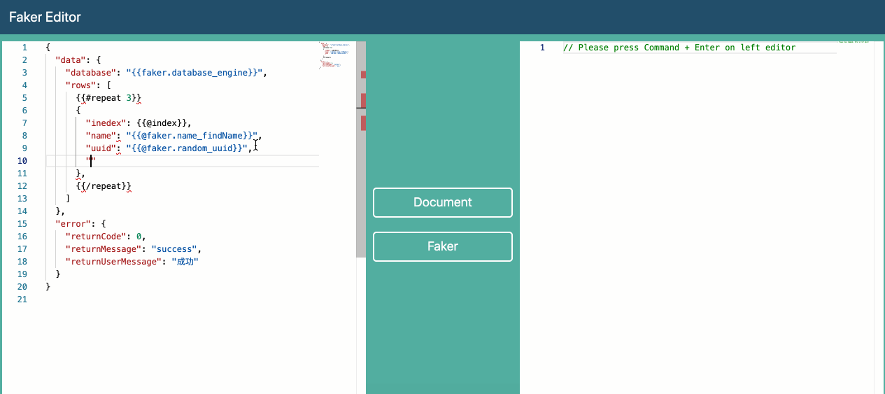

# Faker Editor

The editor is to faker json data

## How to use



## Format

### data

support [faker.js](https://github.com/marak/Faker.js/) Api

simple

```txt
{{faker.<interface>_<method>}}
```

> see fakerjs all method https://github.com/Marak/faker.js#api-methods

example:

```txt
{{faker.database_engine}}
```

result:

```txt
InnoDB
```

> if data in repeat, Please add `@` before the content, such as `{{@faker.name_findName}}`

### repeat

example:

```txt
{{#repeat 3}}
repeat content {{@index}}
{{/repeat}}
```

result:

```txt
repeat content 0
repeat content 1
repeat content 2
```

## Other

### config own data ruler

1. new `jdbData.js` in `utils` folder, such as `/utils/fakerData.js`
2.
  - edit `/src/editor.js`,
  - find function `handleFaker()`, insert `const jdbData = await import("../utils/jdbData");`,
  - add `const result = template({ ... jdb: new jdbData.default().getData() });`
3. use `{{jdb.name_lastName}}`

## Reference

- http://handlebarsjs.com/
- https://github.com/marak/Faker.js/
- https://microsoft.github.io/monaco-editor/index.html
