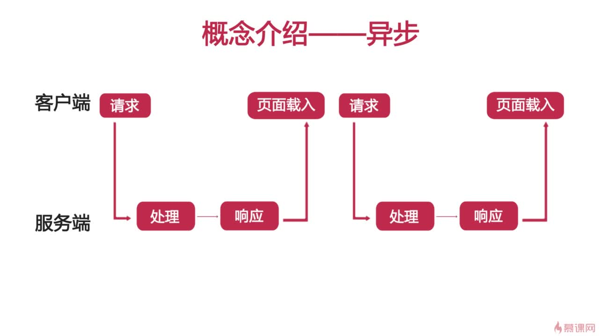
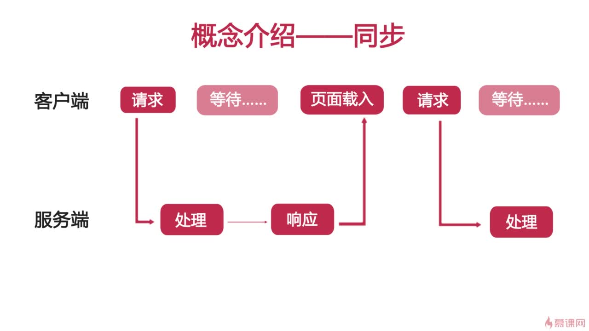
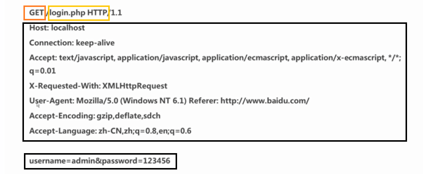
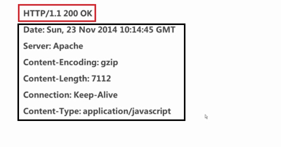
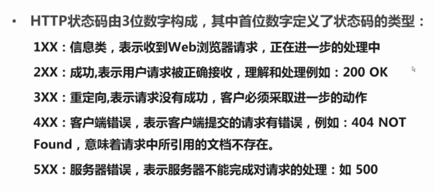

# Ajax+php+jQuery+JSON
  
  
  
## Ajax概念
1. 运用HTML和CSS来实现页面，表达信息
2. 运用XMLHttpRequest和Web服务器端进行数据的异步交换；
3. 运用JavaScript操纵DOM。实现动态局部刷新
  
## 实例化XMLHttpRequest对象
```javascript
var request = new XMLHttpRequest();
```
  
兼容IE5，IE6的写法：  
```javascript
var request;
if (window.XMLHttpRequest) {
    request = new XMLHttpRequest(); //IE7+，Firefox，Chrome，Opera，Safari..
} else {
    request = new ActiveXObject("Microsoft.XMLHTTP"); //IE6,IE5
}
```
  
## HTTP基础
http是计算机通过网络进行通信的规则。  
使客户端(浏览器)向Web服务器请求信息和服务。 
http是一种无状态协议。(无状态指不建立持久的连接。请求与响应结束后，自动关闭)  
### 完整的HTTP请求过程
1. 建立TCP连接
2. Web浏览器向Web服务器发送请求命令
3. Web浏览器发送请求头信息
4. Web服务器应答
5. Web服务器发送应答头信息
6. Web服务器向浏览器发送数据
7. Web服务器关闭TCP连接
  
### 一般HTTP请求由四部分组成：
1. HTTP请求的方法或动作，比如是GET还是POST请求
2. 正在请求的URL，总得知道请求的地址是什么吧
3. 请求头，包含一些客户端环境信息，身份验证信息等
4. 请求体，也就是请求正文，请求正文中可以包含客户提交的查询字符串，表单信息等等
  
一个代码例子：  
  
**GET：**  
* 一般用于信息获取(查询)
* 使用URL传递参数
* 对所发送信息的数量也有限制，一般在2000个字符
* 幂等--比如查询了一次和一万次，都是一个结果
  
**POST：**  
* 一般用于修改服务器上的资源。
* 对所发送信息的数量无限制
  
### 一般HTTP响应由三部分组成：
1. 一个数字和文字组成的状态码，用来显示请求是成功还是失败
2. 响应头，响应头也和请求头一样包含许多有用的信息，例如服务器类型，日期时间，内容类型和长度等
3. 响应体，也就是响应正文
  
一个没有**响应体**的例子：  
  
  
HTTP状态码：  
  
  
## XMLHttpRequest发送请求
* open(method,url,async)
* send(string)
  
1. method:发送请求方法。比如POST,GET。一般要大写
2. url:请求地址
3. async：是否为异步。默认为true
  
```javascript
request.open("GET","get.php",true);
request.send();

request.open("POST","POST.php",true);
request.send();                      //没参数时，基本没意义

request.open("POST","create.php",true);
//设置头信息，发送表单
request.setRequestHeader("Content-type","application/x-www-form-urlencode");
request.send("name=张三&sex=男");
```
  
## XMLHttpRequest取得响应
获取相应的方法：  
* responseText：获得字符串形式的响应数据
* responseXML：获得XML形式的响应数据
* status和statusText：以数字和文本形式返回HTTP状态码
* getALLResponseHeader()：获取所有响应报头
* getResponseHeader()：查询响应中的某个字段的值
  
readyState属性的变化代表服务器响应的变化：  
* 0：请求未初始化，open还没有调用
* 1：服务器连接已建立，open已经调用了
* 2：请求已接收，也就是接收到头信息了
* 3：请求处理中，也就是接收到响应主体了
* 4：请求已完成，且响应已就绪，也就是响应完成了
  
示例代码：  
  
```javascript
var request = new XMLHttpRequest();
request.open("GET","get.php".true);
request.send();
request.onreadystatechange = function() {
    if(request.readyState===4&&request.status===200) {
        //做一些事情
        request.responseText
    }
}
```
  
## 一个例子
服务器php源码：  
```php
<?php
//设置页面内容是html编码格式是utf-8
header("Content-Type: text/plain;charset=utf-8"); 
//header("Content-Type: application/json;charset=utf-8"); 
//header("Content-Type: text/xml;charset=utf-8"); 
//header("Content-Type: text/html;charset=utf-8"); 
//header("Content-Type: application/javascript;charset=utf-8"); 

//定义一个多维数组，包含员工的信息，每条员工信息为一个数组
$staff = array
    (
        array("name" => "洪七", "number" => "101", "sex" => "男", "job" => "总经理"),
        array("name" => "郭靖", "number" => "102", "sex" => "男", "job" => "开发工程师"),
        array("name" => "黄蓉", "number" => "103", "sex" => "女", "job" => "产品经理")
    );

//判断如果是get请求，则进行搜索；如果是POST请求，则进行新建
//$_SERVER是一个超全局变量，在一个脚本的全部作用域中都可用，不用使用global关键字
//$_SERVER["REQUEST_METHOD"]返回访问页面使用的请求方法
if ($_SERVER["REQUEST_METHOD"] == "GET") {
    search();
} elseif ($_SERVER["REQUEST_METHOD"] == "POST"){
    create();
}

//通过员工编号搜索员工
function search(){
    //检查是否有员工编号的参数
    //isset检测变量是否设置；empty判断值为否为空
    //超全局变量 $_GET 和 $_POST 用于收集表单数据
    if (!isset($_GET["number"]) || empty($_GET["number"])) {
        echo "参数错误";
        return;
    }
    //函数之外声明的变量拥有 Global 作用域，只能在函数以外进行访问。
    //global 关键词用于访问函数内的全局变量
    global $staff;
    //获取number参数
    $number = $_GET["number"];
    $result = "没有找到员工。";
    
    //遍历$staff多维数组，查找key值为number的员工是否存在，如果存在，则修改返回结果
    foreach ($staff as $value) {
        if ($value["number"] == $number) {
            $result = "找到员工：员工编号：" . $value["number"] . "，员工姓名：" . $value["name"] . 
                              "，员工性别：" . $value["sex"] . "，员工职位：" . $value["job"];
            break;
        }
    }
    echo $result;
}

//创建员工
function create(){
    //判断信息是否填写完全
    if (!isset($_POST["name"]) || empty($_POST["name"])
        || !isset($_POST["number"]) || empty($_POST["number"])
        || !isset($_POST["sex"]) || empty($_POST["sex"])
        || !isset($_POST["job"]) || empty($_POST["job"])) {
        echo "参数错误，员工信息填写不全";
        return;
    }
    //TODO: 获取POST表单数据并保存到数据库
    
    //提示保存成功
    echo "员工：" . $_POST["name"] . " 信息保存成功！";
}

```
  
客户端HTML源码：  
```html
<!DOCTYPE HTML>
<html>
<head>
<meta http-equiv="Content-Type" content="text/html; charset=utf-8">
<title>Demo</title>
<style>
body, input, select, button, h1 {
    font-size: 28px;
    line-height:1.7;
}
</style>    
</head>

<body>

<h1>员工查询</h1>

<label>请输入员工编号：</label>
<input type="text" id="keyword" />
<button id="search">查询</button>
<p id="searchResult"></p>

<h1>员工新建</h1>
<label>请输入员工姓名：</label>
<input type="text" id="staffName" /><br>
<label>请输入员工编号：</label>
<input type="text" id="staffNumber" /><br>
<label>请选择员工性别：</label>
<select id="staffSex">
<option>女</option>
<option>男</option>
</select><br>
<label>请输入员工职位：</label>
<input type="text" id="staffJob" /><br>
<button id="save">保存</button>
<p id="createResult"></p>

<script>
document.getElementById("search").onclick = function() { 
    var request = new XMLHttpRequest();
    request.open("GET", "server.php?number=" + document.getElementById("keyword").value);
    request.send();
    request.onreadystatechange = function() {
        if (request.readyState===4) {
            if (request.status===200) { 
                document.getElementById("searchResult").innerHTML = request.responseText;
            } else {
                alert("发生错误：" + request.status);
            }
        } 
    }
}

document.getElementById("save").onclick = function() { 
    var request = new XMLHttpRequest();
    request.open("POST", "server.php");
    var data = "name=" + document.getElementById("staffName").value 
                      + "&number=" + document.getElementById("staffNumber").value 
                      + "&sex=" + document.getElementById("staffSex").value 
                      + "&job=" + document.getElementById("staffJob").value;
    request.setRequestHeader("Content-type","application/x-www-form-urlencoded");
    request.send(data);
    request.onreadystatechange = function() {
        if (request.readyState===4) {
            if (request.status===200) { 
                document.getElementById("createResult").innerHTML = request.responseText;
            } else {
                alert("发生错误：" + request.status);
            }
        } 
    }
}
</script>
</body>
</html>

```
  
## JSON
JSON：JavaScript对象表示法(JavaScript Object Notation)  
JSON是存储和交换文本信息的语法，类似XML。它采用键值对的方式来组织，易于人们阅读和编写，同时也易于机器解析和生成。  
JSON是独立于语言的，也就是说不管什么语言，都可以解析json，只需要按照json的规则来就行。  
### JSON与XML相比
* JSON的长度和xml格式比起来很短小
* JSON读写的速度更快
* JSON可以使用Javascript内建的方法直接进行解析，转换成Javascript对象，非常方便
  
### 语法规则
* json数据的书写格式是：名称/值对。
_名称/值对组合中的名称写在前面(在双引号中)，值对写在后面(同样在双引号中)，中间用冒号隔开：比如"name":"郭靖"_  
#### json的值可以是下面这些类型：
* 数字(整数或浮点数)，比如123，321
* 字符串(在双引号中)
* 逻辑值(true或false)
* 数组(在方括号中)
* 对象(在花括号中)
* null
  
例子：  
```json
{
    "staff":[
        {"name":"洪崎","age":70},
        {"name":"郭靖","age":35},
        {"name":"黄蓉","age":30}
    ]
}
```
  
### JSON解析--JSON.parse()
示例：  
```javascript
var jsondata= '{"staff":[{"name":"洪崎","age":70},{"name":"洪崎","age":70},{"name":"黄蓉","age":30}]}';
var jsonobj =JSON.parse(jsondata);
alert(jsonobj.staff[0].name);
```
  
### JSON校验工具及官网
* www.json.org
* www.jsonlint.com
  
修改后的服务端代码：  
```php
<?php
//设置页面内容是html编码格式是utf-8
//header("Content-Type: text/plain;charset=utf-8"); 
header("Content-Type: application/json;charset=utf-8"); 
//header("Content-Type: text/xml;charset=utf-8"); 
//header("Content-Type: text/html;charset=utf-8"); 
//header("Content-Type: application/javascript;charset=utf-8"); 

//定义一个多维数组，包含员工的信息，每条员工信息为一个数组
$staff = array
    (
        array("name" => "洪七", "number" => "101", "sex" => "男", "job" => "总经理"),
        array("name" => "郭靖", "number" => "102", "sex" => "男", "job" => "开发工程师"),
        array("name" => "黄蓉", "number" => "103", "sex" => "女", "job" => "产品经理")
    );

//判断如果是get请求，则进行搜索；如果是POST请求，则进行新建
//$_SERVER是一个超全局变量，在一个脚本的全部作用域中都可用，不用使用global关键字
//$_SERVER["REQUEST_METHOD"]返回访问页面使用的请求方法
if ($_SERVER["REQUEST_METHOD"] == "GET") {
    search();
} elseif ($_SERVER["REQUEST_METHOD"] == "POST"){
    create();
}

//通过员工编号搜索员工
function search(){
    //检查是否有员工编号的参数
    //isset检测变量是否设置；empty判断值为否为空
    //超全局变量 $_GET 和 $_POST 用于收集表单数据
    if (!isset($_GET["number"]) || empty($_GET["number"])) {
        echo '{"success":false,"msg":"参数错误"}';
        return;
    }
    //函数之外声明的变量拥有 Global 作用域，只能在函数以外进行访问。
    //global 关键词用于访问函数内的全局变量
    global $staff;
    //获取number参数
    $number = $_GET["number"];
    $result = '{"success":false,"msg":"没有找到员工。"}';
    
    //遍历$staff多维数组，查找key值为number的员工是否存在，如果存在，则修改返回结果
    foreach ($staff as $value) {
        if ($value["number"] == $number) {
            $result = '{"success":true,"msg":"找到员工：员工编号：' . $value["number"] . 
                            '，员工姓名：' . $value["name"] . 
                            '，员工性别：' . $value["sex"] . 
                            '，员工职位：' . $value["job"] . '"}';
            break;
        }
    }
    echo $result;
}

//创建员工
function create(){
    //判断信息是否填写完全
    if (!isset($_POST["name"]) || empty($_POST["name"])
        || !isset($_POST["number"]) || empty($_POST["number"])
        || !isset($_POST["sex"]) || empty($_POST["sex"])
        || !isset($_POST["job"]) || empty($_POST["job"])) {
        echo '{"success":false,"msg":"参数错误，员工信息填写不全"}';
        return;
    }
    //TODO: 获取POST表单数据并保存到数据库
    
    //提示保存成功
    echo '{"success":true,"msg":"员工：' . $_POST["name"] . ' 信息保存成功！"}';
}

?>
```
  
客户端代码：  
```html
<!DOCTYPE HTML>
<html>
<head>
<meta http-equiv="Content-Type" content="text/html; charset=utf-8">
<title>Demo</title>
<style>
body, input, select, button, h1 {
    font-size: 28px;
    line-height:1.7;
}
</style>    
</head>

<body>

<h1>员工查询</h1>

<label>请输入员工编号：</label>
<input type="text" id="keyword" />
<button id="search">查询</button>
<p id="searchResult"></p>

<h1>员工新建</h1>
<label>请输入员工姓名：</label>
<input type="text" id="staffName" /><br>
<label>请输入员工编号：</label>
<input type="text" id="staffNumber" /><br>
<label>请选择员工性别：</label>
<select id="staffSex">
<option>女</option>
<option>男</option>
</select><br>
<label>请输入员工职位：</label>
<input type="text" id="staffJob" /><br>
<button id="save">保存</button>
<p id="createResult"></p>

<script>
document.getElementById("search").onclick = function() { 
    var request = new XMLHttpRequest();
    request.open("GET", "serverjson.php?number=" + document.getElementById("keyword").value);
    request.send();
    request.onreadystatechange = function() {
        if (request.readyState===4) {
            if (request.status===200) { 
                var data = JSON.parse(request.responseText);
                if (data.success) { 
                    document.getElementById("searchResult").innerHTML = data.msg;
                } else {
                    document.getElementById("searchResult").innerHTML = "出现错误：" + data.msg;
                }
            } else {
                alert("发生错误：" + request.status);
            }
        } 
    }
}

document.getElementById("save").onclick = function() { 
    var request = new XMLHttpRequest();
    request.open("POST", "serverjson.php");
    var data = "name=" + document.getElementById("staffName").value 
                      + "&number=" + document.getElementById("staffNumber").value 
                      + "&sex=" + document.getElementById("staffSex").value 
                      + "&job=" + document.getElementById("staffJob").value;
    request.setRequestHeader("Content-type","application/x-www-form-urlencoded");
    request.send(data);
    request.onreadystatechange = function() {
        if (request.readyState===4) {
            if (request.status===200) { 
                var data = JSON.parse(request.responseText);
                if (data.success) { 
                    document.getElementById("createResult").innerHTML = data.msg;
                } else {
                    document.getElementById("createResult").innerHTML = "出现错误：" + data.msg;
                }
            } else {
                alert("发生错误：" + request.status);
            }
        } 
    }
}
</script>
</body>
</html>

```
  
## jQuery中的Ajax
**jQuery.ajax([setting])**  
* type:类型，"POST"或"GET",默认为"GET"
* url：发送请求的地址
* data：是一个对象，连同请求发送到服务器的数据
* dataType：预期服务器返回的数据类型。如果不指定，jQuery将自动根据HTTP包MIME信息来智能判断，一般我们采用json格式，可以设置为"json"
* success：是一个方法，请求成功后的回调函数。传入返回后的数据，以及包含成功码的字符串
* error：是一个方法，请求失败时调用此函数。传入XMLHttpRequest
  
用jQuery改写，客户端代码：  
```html
<!DOCTYPE HTML>
<html>
<head>
<meta http-equiv="Content-Type" content="text/html; charset=utf-8">
<title>Demo</title>
<style>
body, input, select, button, h1 {
    font-size: 28px;
    line-height:1.7;
}
</style>    
</head>

<body>

<h1>员工查询</h1>

<label>请输入员工编号：</label>
<input type="text" id="keyword" />
<button id="search">查询</button>
<p id="searchResult"></p>

<h1>员工新建</h1>
<label>请输入员工姓名：</label>
<input type="text" id="staffName" /><br>
<label>请输入员工编号：</label>
<input type="text" id="staffNumber" /><br>
<label>请选择员工性别：</label>
<select id="staffSex">
<option>女</option>
<option>男</option>
</select><br>
<label>请输入员工职位：</label>
<input type="text" id="staffJob" /><br>
<button id="save">保存</button>
<p id="createResult"></p>

<script src="http://apps.bdimg.com/libs/jquery/1.11.1/jquery.js"></script>
<script>
$(document).ready(function(){ 
    $("#search").click(function(){ 
        $.ajax({ 
            type: "GET",    
            url: "http://127.0.0.1:8080/ajaxdemo/serverjson2.php?number=" + $("#keyword").val(),
            dataType: "json",
            success: function(data) {
                if (data.success) { 
                    $("#searchResult").html(data.msg);
                } else {
                    $("#searchResult").html("出现错误：" + data.msg);
                }  
            },
            error: function(jqXHR){     
               alert("发生错误：" + jqXHR.status);  
            },     
        });
    });
    
    $("#save").click(function(){ 
        $.ajax({ 
            type: "POST",   
            url: "serverjson.php",
            data: {
                name: $("#staffName").val(), 
                number: $("#staffNumber").val(), 
                sex: $("#staffSex").val(), 
                job: $("#staffJob").val()
            },
            dataType: "json",
            success: function(data){
                if (data.success) { 
                    $("#createResult").html(data.msg);
                } else {
                    $("#createResult").html("出现错误：" + data.msg);
                }  
            },
            error: function(jqXHR){     
               alert("发生错误：" + jqXHR.status);  
            },     
        });
    });
});
</script>
</body>
</html>

```
  
服务器端代码：  
```php
<?php
//设置页面内容是html编码格式是utf-8
//header("Content-Type: text/plain;charset=utf-8"); 
header('Access-Control-Allow-Origin:*');
header('Access-Control-Allow-Methods:POST,GET');
header('Access-Control-Allow-Credentials:true'); 
header("Content-Type: application/json;charset=utf-8"); 
//header("Content-Type: text/xml;charset=utf-8"); 
//header("Content-Type: text/html;charset=utf-8"); 
//header("Content-Type: application/javascript;charset=utf-8"); 

//定义一个多维数组，包含员工的信息，每条员工信息为一个数组
$staff = array
    (
        array("name" => "洪七", "number" => "101", "sex" => "男", "job" => "总经理"),
        array("name" => "郭靖", "number" => "102", "sex" => "男", "job" => "开发工程师"),
        array("name" => "黄蓉", "number" => "103", "sex" => "女", "job" => "产品经理")
    );

//判断如果是get请求，则进行搜索；如果是POST请求，则进行新建
//$_SERVER是一个超全局变量，在一个脚本的全部作用域中都可用，不用使用global关键字
//$_SERVER["REQUEST_METHOD"]返回访问页面使用的请求方法
if ($_SERVER["REQUEST_METHOD"] == "GET") {
    search();
} elseif ($_SERVER["REQUEST_METHOD"] == "POST"){
    create();
}

//通过员工编号搜索员工
function search(){
    //检查是否有员工编号的参数
    //isset检测变量是否设置；empty判断值为否为空
    //超全局变量 $_GET 和 $_POST 用于收集表单数据
    if (!isset($_GET["number"]) || empty($_GET["number"])) {
        echo '{"success":false,"msg":"参数错误"}';
        return;
    }
    //函数之外声明的变量拥有 Global 作用域，只能在函数以外进行访问。
    //global 关键词用于访问函数内的全局变量
    global $staff;
    //获取number参数
    $number = $_GET["number"];
    $result = '{"success":false,"msg":"没有找到员工。"}';
    
    //遍历$staff多维数组，查找key值为number的员工是否存在，如果存在，则修改返回结果
    foreach ($staff as $value) {
        if ($value["number"] == $number) {
            $result = '{"success":true,"msg":"找到员工：员工编号：' . $value["number"] . 
                            '，员工姓名：' . $value["name"] . 
                            '，员工性别：' . $value["sex"] . 
                            '，员工职位：' . $value["job"] . '"}';
            break;
        }
    }
    echo $result;
}

//创建员工
function create(){
    //判断信息是否填写完全
    if (!isset($_POST["name"]) || empty($_POST["name"])
        || !isset($_POST["number"]) || empty($_POST["number"])
        || !isset($_POST["sex"]) || empty($_POST["sex"])
        || !isset($_POST["job"]) || empty($_POST["job"])) {
        echo '{"success":false,"msg":"参数错误，员工信息填写不全"}';
        return;
    }
    //TODO: 获取POST表单数据并保存到数据库
    
    //提示保存成功
    echo '{"success":true,"msg":"员工：' . $_POST["name"] . ' 信息保存成功！"}';
}

?>
```
