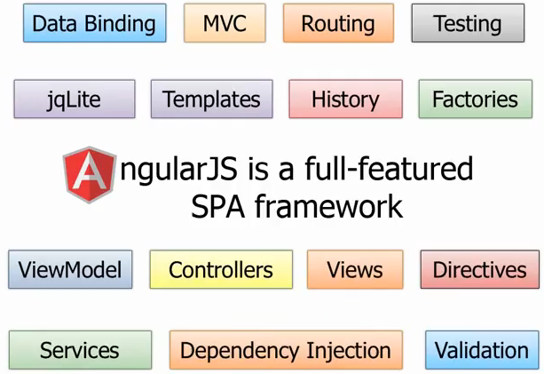
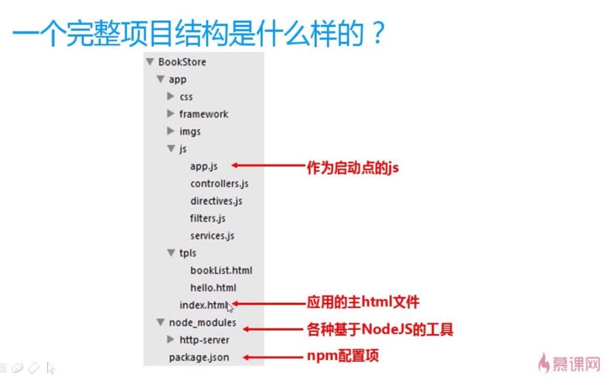

## AngularJS概要
AngularJS是Google推出的一款Web应用开发框架。他提供了一系列兼容性良好并可扩展的服务，包括数据绑定、DOM操作、MVC和依赖注入等特性。如图：  
  
从上图发现，AngularJS几乎支持构建一个Web应用的所有内容--数据绑定、表单验证、路由、依赖注入、控制器、模版和视图等。  
  
但并不是所有应用都适合用AngularJs来做。AngularJs主要考虑的是构建CURD应用，但至少90%的Web应用都是CURD应用(CRUD是指在做计算处理时的增加(Create)、重新取得数据(Retrieve)、更新(Update)和删除(Delete)几个单词的首字母简写。主要被用在描述软件系统中数据库或者持久层的基本操作功能。) 。如游戏、图像界面编辑器等应用不适合AngularJS来构建。  
  
### AngularJs核心知识点  
* 指令(directive)和数据绑定(Data Binding)
* 模板(Module)
* 控制器(Controller)
* 路由(Route)
* 服务(service)
* 过滤器(Filter)
  
#### 指令和数据绑定  

在没有使用AngularJs的Web应用，要实现前台页面逻辑通过给HTML元素设置ID，然后使用JS或Jquery通过ID来获取HTML DOM元素。而AngularJs不需要给HTML元素设置ID，而是使用指令的方式来知道HTML元素的行为。这样做的好处是开发人员看到HTML元素以及指令(Directive)就可以理解其行为，而传统设置ID的方式并不能给你带来任何有用的信息，你需要深入去查看对应的Js代码来理解行为。  
指令可以理解为声明特殊的标签或属性。AngularJS内置了很多的指令，你所看到的以ng开头的所有标签，如ng-app、ng-init、ng-if、ng-model等。  
ng-app：用于标识页面是一个AngularJs页面。一般加载HTML的跟对象上。
ng-init：用于初始化一个变量。
ng-model：用户在Property和Html空间之间建立双向的数据绑定(Data Binding)。这样Html空间的值改变会反应到Property上，反过来也同样成立。  
AngularJS通过表达式的方式将数据绑定到HTML标签内。AngularJs的表达式写在双大括号内：｛｛expression｝｝  
一个指令的例子：  
```html
<!DOCTYPE html>
<html ng-app xmlns="http://www.w3.org/1999/xhtml">
<head>
    <meta http-equiv="Content-Type" content="text/html; charset=utf-8" />
    <title>Using Directives and Data Binding Syntax</title>
</head>
<body ng-init="name = '欢迎学习AngularJS'">
    <div>
        Name: <input type="text" ng-model="name" /> {{name}}
    </div>
    <script src="/Scripts/angular.min.js"></script>
</body>
</html>
```
  
当我们改变输入框的值时，对应的改变会反应到name属性上，从而反应到表达式的值。AngularJS中双向绑定的使用主要是靠ng-model指令开完成的。  
#### 模版
AngularJs的模板指的是前端模板。AngularJS有内置的前端模板引擎，即所有页面渲染的操作都是放在浏览器端来渲染的，这也是SPA程序的一个优势所在，所有前端框架都内置了前端模板引擎，将页面的渲染放在前端来做，从而减轻服务端的压力。  
在AngularJs中的模板就是指带有ng-app指令的HTML代码。AngularJs发现Html页面是否需要用AngularJs模板引擎去渲染的标志就是ng-app标签。  
**在AngularJs中，我们写的其实也并不是纯的Html页面，而是模板，最终用户看到的Html页面（也就是视图）是通过模板渲染后的结果。**  
一个模版的例子：  
```html
<!DOCTYPE html>
<html ng-app="mainApp">
<head>
    <meta http-equiv="Content-Type" content="text/html; charset=utf-8" />
    <title>Template Demo</title>
      <script src="http://sandbox.runjs.cn/uploads/rs/376/pbcx3e1z/angular.min.js"></script>
    <script>
        (function() {
              // 创建模块
                var mainApp = angular.module("mainApp",[]);
               // 创建控制器，并注入scope
                 mainApp.controller("tempController", ["$scope", function ($scope) {
         $scope.val = "Welcome to Study AngularJs.";
            }]);
        })()
    </script>
</head>
<body>
    <h2>AngularJS 模块演示</h2>
  
    <div ng-controller="tempController">
        <div><input type="text" ng-model="val">  {{val}}</div>
    </div>
  
</body>
</html>
```
  
#### 控制器
实模板中的例子中，我们就已经定义了名为"tempController"的控制器了。其实AngularJs控制器的作用是模型和视图之间的桥梁。AngularJs的模型对象是$scope。所以AngularJs控制器只是$scope和视图之间的桥梁，它通过操作$scope对象来改变视图。  
一个控制器的例子：  
```html
<!DOCTYPE html>
<html ng-app="mainApp">
<head>
    <meta http-equiv="Content-Type" content="text/html; charset=utf-8" />
    <title>AngularJS 控制器演示</title>
    <script src="http://sandbox.runjs.cn/uploads/rs/376/pbcx3e1z/angular.min.js">
    </script>
    
     <script>
        (function() {
              // 创建模块
                var mainApp = angular.module("mainApp", []);
                mainApp.controller("cntoController", ["$scope", function ($scope) {
                                var defaultValue = "hello world";
                                    $scope.val = defaultValue;
                                $scope.click = function () {
                                    $scope.val = defaultValue;
                                };
                            }]);
        })()
    </script>
</head>
<body>
    <h2>AngularJS 控制器演示</h2>
    <div ng-controller="cntoController">
        <div><textarea ng-model="val"></textarea></div>
        <div>{{val}}</div>
        <div><button ng-click="click()">重置</button></div>
    </div>
    
</body>
</html>
```
  
#### 路由
之所以说AngularJs框架=MVC+MVVM，是因为AngularJs除了支持双向绑定外（即MVVM特点），还支持路由。  
单页Web应用由于没有后端URL资源定位的支持，需要自己实现URL资源定位。AngularJs使用浏览器URL"#"后的字符串来定位资源。路由机制并非在AngularJS核心文件内，你需要另外加入angular-route.min.js脚本。并且创建mainApp模块的时候需要添加对ngRoute的依赖。  
一个路由的例子：  
```html
<!DOCTYPE html>
<html ng-app="mainApp" xmlns="http://www.w3.org/1999/xhtml">
<head>
    <meta http-equiv="Content-Type" content="text/html; charset=utf-8" />
    <title>AngularJs路由演示</title>
    <script src="http://sandbox.runjs.cn/uploads/rs/376/pbcx3e1z/angular.min.js"></script>
    <script src="http://sandbox.runjs.cn/uploads/rs/376/pbcx3e1z/angular-route.min.js"></script>
    <script>
        (function() {
            // 设置当前模块依赖，“ngRoute”，用.NET的解就是给这个类库添加“ngRoute”引用
            var mainApp = angular.module("mainApp", ['ngRoute']);
            mainApp.config(['$routeProvider', function($routeProvider) {
                // 路由配置
                var route = $routeProvider;
                // 指定URL为“/” 控制器：“listController”，模板：“route-list.html”
                route.when('/list', { controller: 'listController', templateUrl: 'route-list.html' });
                // 注意“/view/:id” 中的 “：id” 用于捕获参数ID
                route.when('/view/:id', { controller: 'viewController', templateUrl: 'route-view.html' });
                // 跳转
                route.when("/", { redirectTo: '/list' });
                route.otherwise({ redirectTo: '/list' });
            }]);

            //创建一个提供数据的服务器
            mainApp.factory("service", function() {
                var list = [
                    { id: 1, title: "博客园", url: "http://www.cnblogs.com" },
                    { id: 2, title: "知乎", url: "http://www.zhihu.com" },
                    { id: 3, title: "codeproject", url: "http://www.codeproject.com/" },
                    { id: 4, title: "stackoverflow", url: "http://www.stackoverflow.com/" }
                ];
                return function(id) {
                    //假如ID为无效值返回所有
                    if (!id) return list;
                    var t = 0;
                    //匹配返回的项目
                    angular.forEach(list, function(v, i) {
                        if (v.id == id) t = i;
                    });
                    return list[t];
                }
            });

            // 创建控制器 listController,注入提供数据服务
            mainApp.controller("listController", ["$scope", "service", function($scope, service) {
                //获取所有数据
                $scope.list = service();
            }]);

            // 创建查看控制器 viewController, 注意应为需要获取URL ID参数 我们多设置了一个 依赖注入参数 “$routeParams” 通过它获取传入的 ID参数
            mainApp.controller("viewController", ["$scope", "service", '$routeParams', function($scope, service, $routeParams) {
                $scope.model = service($routeParams.id || 0) || {};
            }]);
        })()
    </script>
</head>
<body>
    <div><a href="#/list">列表</a></div>
    <br />
    <div ng-view>
    </div>

</body>
</html>
```
  
列表页面route-list.html  
```html
<ul ng-repeat= "item in list">
    <li><a href="#view/{{item.id}}">{{item.title}}</a></li>
</ul>
```
  
详细页面 route-view.html  
```html
<div>
    <div>网站ID：{{model.id}}</div>
    <div>网站名称：<a href="{{model.url}}" rel="nofollow">{{model.title}}</a></div>
    <div>访问地址：{{model.url}}</div>
</div>
```
  
#### 自定义指令
如果我们在程序中需要对DOM操作的话，我们可以使用指令来完成。  
一个全选复选框的自定义指令的例子：  
```html
<!DOCTYPE html>
<html ng-app="mainApp" xmlns="http://www.w3.org/1999/xhtml">
<head>
    <meta http-equiv="Content-Type" content="text/html; charset=utf-8" />
    <title>AngularJs 指令演示</title>
    <script src="http://sandbox.runjs.cn/uploads/rs/376/pbcx3e1z/jquery-1.10.2.min.js"></script>
    <script src="http://sandbox.runjs.cn/uploads/rs/376/pbcx3e1z/angular.min.js"></script>
    <script>
        (function(){ 
            var mainApp = angular.module("mainApp", []);
            //创建一个提供数据的服务器
            mainApp.factory("service", function () {
        var list = [
           { id: 1, title: "博客园", url: "http://www.cnblogs.com" },
           { id: 2, title: "知乎", url: "http://www.zhihu.com" },
           { id: 3, title: "codeproject", url: "http://www.codeproject.com/" },
           { id: 4, title: "stackoverflow", url: "http://www.stackoverflow.com/" }
        ];
        return function (id) {
            //假如ID为无效值返回所有
            if (!id) return list;
            var t = 0;
            //匹配返回的项目
            angular.forEach(list, function (v, i) {
                if (v.id == id) t = i;
            });
            return list[t];
        };
    });
            
            mainApp.directive('imCheck', [function () {
        return {
            restrict: 'A',
            replace: false,
            link: function (scope, element) {
                var all = "thead input[type='checkbox']";
                var item = "tbody input[type='checkbox']";
                //当点击选择所有项目
                element.on("change", all, function () {
                    var o = $(this).prop("checked");
                    var tds = element.find(item);
                    tds.each(function (i, check) {
                        $(check).prop("checked", o);
                    });
                });
                //子项修改时的超值
                element.on("change", item, function () {
                    var o = $(this).prop("checked");
                    var isChecked = true;
                    if (o) {
                        element.find(item).each(function () {
                            if (!$(this).prop("checked")) {
                                isChecked = false;
                                return false;
                            }
                            return true;
                        });
                    }
                    element.find(all).prop("checked", o && isChecked);
                });
            }
        };
    }]);
            
            mainApp.controller("dectController", ['$scope', 'service', function ($scope, service) {
        $scope.list = service();
    }]);
            
        })()
    </script>
</head>
<body>
    <h2>AngularJs 指令演示</h2>
    <table ng-controller="dectController" im-check>
        <thead>
            <tr>
                <th><input type="checkbox">选择</th>
                <th>网站ID</th>
                <th>网站名称</th>
                <th>链接地址</th>
            </tr>
        </thead>
        <tbody>
            <tr ng-repeat="item in list">
                <td><input type="checkbox"></td>
                <td>{{item.id}}</td>
                <td>{{item.title}}</td>
                <td>{{item.url}}</td>
            </tr>
        </tbody>
    </table>

   
</body>
</html>
```
  
#### 服务
在上面的路由例子和自定义指令中都有用到AngularJs中的服务。开理解为AngularJs的服务主要是封装请求数据的内容。然后AngularJs中的服务一个很重要的一点是：服务是单例的。一个服务在AngularJS应用中只会被注入实例化一次，并贯穿整个生命周期，与控制器进行通信。即控制器操作$scope对象来改变视图，如果控制器需要请求数据的话，则是调用服务来请求数据的，而服务获得数据可以通过Http服务(AngularJS内置的服务)来请求后端的Web API来获得所需要的数据。  
AngularJS系统内置的服务以$开头，我们也可以自己定义一个服务。定义服务的方式有如下几种：  
* 使用系统内置的$provide服务
* 使用Module的factory方法
* 使用Module的service方法
  
一个使用$provide服务创建服务的例子：  
```html
<!DOCTYPE html>
<html ng-app="mainApp" xmlns="http://www.w3.org/1999/xhtml">
<head>
    <meta http-equiv="Content-Type" content="text/html; charset=utf-8" />
    <title>AngularJs 指令演示</title>
    <script src="http://sandbox.runjs.cn/uploads/rs/376/pbcx3e1z/jquery-1.10.2.min.js"></script>
    <script src="http://sandbox.runjs.cn/uploads/rs/376/pbcx3e1z/angular.min.js"></script>
    <script>
        (function(){ 
            var mainApp = angular.module("mainApp", []).config(['$provide', function($provide){
            // 使用系统内置的$provide服务来创建一个提供数据的服务器
            $provide.factory("service", function () {
        var list = [
           { id: 1, title: "博客园", url: "http://www.cnblogs.com" },
           { id: 2, title: "知乎", url: "http://www.zhihu.com" },
           { id: 3, title: "codeproject", url: "http://www.codeproject.com/" },
           { id: 4, title: "stackoverflow", url: "http://www.stackoverflow.com/" }
        ];
        return function (id) {
            //假如ID为无效值返回所有
            if (!id) return list;
            var t = 0;
            //匹配返回的项目
            angular.forEach(list, function (v, i) {
                if (v.id == id) t = i;
            });
            return list[t];
        };
     });
            }]);
            
            mainApp.directive('imCheck', [function () {
        return {
            restrict: 'A',
            replace: false,
            link: function (scope, element) {
                var all = "thead input[type='checkbox']";
                var item = "tbody input[type='checkbox']";
                //当点击选择所有项目
                element.on("change", all, function () {
                    var o = $(this).prop("checked");
                    var tds = element.find(item);
                    tds.each(function (i, check) {
                        $(check).prop("checked", o);
                    });
                });
                //子项修改时的超值
                element.on("change", item, function () {
                    var o = $(this).prop("checked");
                    var isChecked = true;
                    if (o) {
                        element.find(item).each(function () {
                            if (!$(this).prop("checked")) {
                                isChecked = false;
                                return false;
                            }
                            return true;
                        });
                    }
                    element.find(all).prop("checked", o && isChecked);
                });
            }
        };
    }]);
            
        mainApp.controller("dectController", ['$scope', 'service', function ($scope, service) {
        $scope.list = service();
    }]);
            
        })()
    </script>
</head>
<body>
    <h2>AngularJs 指令演示</h2>
    <table ng-controller="dectController" im-check>
        <thead>
            <tr>
                <th><input type="checkbox">选择</th>
                <th>网站ID</th>
                <th>网站名称</th>
                <th>链接地址</th>
            </tr>
        </thead>
        <tbody>
            <tr ng-repeat="item in list">
                <td><input type="checkbox"></td>
                <td>{{item.id}}</td>
                <td>{{item.title}}</td>
                <td>{{item.url}}</td>
            </tr>
        </tbody>
    </table>
</body>
</html>
```
  
#### 过滤器
AngularJs过滤器就是用来格式化数据的，包括排序，筛选、转化数据等操作。  
一个反转过滤器的例子：  
```html
<!DOCTYPE html>
<html ng-app="mainApp" xmlns="http://www.w3.org/1999/xhtml">
<head>
    <meta http-equiv="Content-Type" content="text/html; charset=utf-8" />
    <title>AngularJs 过滤器演示</title>
   
    <script src="http://sandbox.runjs.cn/uploads/rs/376/pbcx3e1z/angular.min.js"></script>
  <script>
        (function () {
            var mainApp = angular.module("mainApp", []);
            
                        // 定义反转过滤器，过滤器用来格式化数据(转化，排序，筛选等操作)。
                    mainApp.filter('reverse', function() {
                        return function(input, uppercase) {
                            input = input || '';
                            var out = "";
                            for (var i = 0; i < input.length; i++) {
                                out = input.charAt(i) + out;
                            }
            
                            if (uppercase) {
                                out = out.toUpperCase();
                            }
                        return out;
                        };            
                        });
                        
                        mainApp.controller("filterController", ['$scope', function($scope) {
                            $scope.greeting = "AngularJs";
                        }]);
            })()
    </script>
</head>
<body>
    <div ng-controller="filterController">
        <input ng-model="greeting" type="text"><br>
        No filter: {{greeting}}<br>
        Reverse: {{greeting|reverse}}<br>
        Reverse + uppercase: {{greeting|reverse:true}}<br>
    </div>
   
</body>
</html>
```
  
#### 前端模块化开发
将职责单一，功能相似的代码放在一起，有利于后期的维护。累死模块化的框架有：RequireJS、SeaJs等。  

