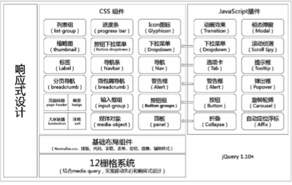

## Bootstrap整体架构
  
从上面的图，可以清楚看到，Bootstrap主要有下面几部分组成:  
* **12栅格系统**--就是将屏幕平分12份（列）。使用行（row）来组织元素（每一行都包括12列），然后将其内容放在列内。通过col-md-offset-* 来控制列偏移。
* **基础布局组件**--Bootstrap提供了多种基础布局组件。如排版、代码、表格、按钮、表单等。
* **Jquery**--Bootstrap所有的JavaScript插件都依赖于Jquery的。如果要使用这些插件，就必须引用Jquery库。这也是很为什么我们除了要引用Bootstrap的JS文件和CSS文件外，还需要引用Jquery库的原因，两者是依赖关系。
* **CSS组件**--Bootstrap为我们预实现了很多CSS组件。如下拉框、按钮框、导航等。也就是说Bootstrap内容帮我们定义了很多CSS样式，你可以将这些样式直接用到之前的下拉框等元素。
* **JavaScript插件**--Bootstrap也为我们实现了一些JS插件，我们可以用其提供的插件完成一些常用功能，而不需要我们再重新写JS代码来实现像提示框，模态窗口这样的效果
* **响应式设计**--这是个设计理念。响应式的意思就是他会根据屏幕尺寸来自动调整页面，使得前端页面在不同尺寸的屏幕上都可以表现很好。
  
## 12栅格系统
Bootstrap定义12栅格系统，就是为了更好的布局。每个前端框架首先要定义好的就是布局系统。在Bootstrap里面，就是利用行和列来创建页面布局。其布局有几个原则：  
* 行(row)必须包含在.container(固定高度)或.container-fluid(100%宽度)中
* 每行包含12列
* 将内容放置在每列中
  
在Bootstrap的栅格系统中，根据宽度将浏览器分为4种。其值分别是：自动(100%)、750px、970px、1170px。对应的样式为超小(xs)、小型(sm)、中型屏幕(md)、大型(lg)其实就是通过媒体查询定义最小宽度实现。所以，Bootstrap做出来的网页向大兼容，向小不兼容(原因是移动设备优先)。  
```
/* 超小屏幕（手机，小于 768px） */
/* 没有任何媒体查询相关的代码，因为这在 Bootstrap中是默认的(移动设备优先)*/

/* 小屏幕（平板，大于等于 768px） */
@media (min-width: @screen-sm-min) { ... }

/* 中等屏幕（桌面显示器，大于等于 992px） */
@media (min-width: @screen-md-min) { ... }

/* 大屏幕（大桌面显示器，大于等于 1200px） */
@media (min-width: @screen-lg-min) { ... }
```
  
## 基础布局组件  

* [Table](../codes/Bootstrap/Boostrap_table.html)
* [button](../codes/Bootstrap/Boostrap_Button.html)
* [form](../codes/Bootstrap/Boostrap_form.html)
  
## CSS插件
  
* [分页](../codes/Bootstrap/Boostrap_pagination.html)
* [下拉菜单](../codes/Bootstrap/Boostrap_Dropdown.html)
* [面板](../codes/Bootstrap/Boostrap_table.html)

## JavaScript插件
  
* [模态窗口](../codes/Bootstrap/Boostrap_Modal.html)  
  
### 更多例子请查看codes文件
