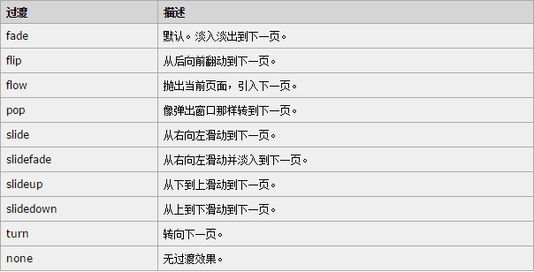
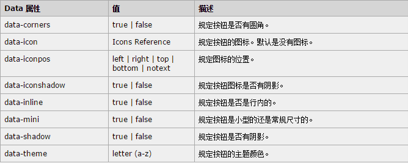
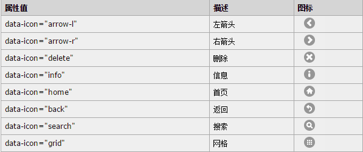
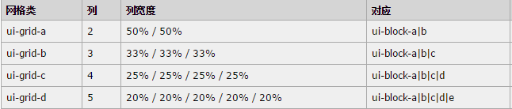

# jQuer Mobile 概要
## jQuery Mobile 基础
### 简介
  
jQuery Mobile 是一种 web 框架，用于创建移动 web 应用程序。  
jQuery Mobile 是一个为触控优化的框架，用于创建移动 web 应用程序。  
jQuery 适用于所有流行的智能手机和平板电脑。  
jQuery Mobile 构建于 jQuery 库之上，这使其更易学习，如果您通晓 jQuery 的话。  
它使用 HTML5、CSS3、JavaScript 和 AJAX 通过尽可能少的代码来完成对页面的布局。  
jQuery Mobile 将“写得更少、做得更多”这一理念提升到了新的层次：它会自动为网页设计交互的易用外观，并在所有移动设计上保持一致。  
尽管 jQuery Mobile 工作于所有移动设备，它可能在桌面计算机上存在兼容性问题（“归功于”有限的 CSS3 支持）。  
  
### jQuery Mobile 安装
* 从CDN 引用 jQuery Mobile（推荐）
* 从 jQuerymobile.com 下载 jQuery Mobile 库
  
#### 从 CDN 引用 jQuery Mobile
**提示：**CDN (Content Delivery Network) 用于通过 web 来分发常用的文件，以此加快用户的下载速度。  
```html
<head>
<link rel="stylesheet" href="http://code.jquery.com/mobile/1.3.2/jquery.mobile-1.3.2.min.css">
<script src="http://code.jquery.com/jquery-1.8.3.min.js"></script>
<script src="http://code.jquery.com/mobile/1.3.2/jquery.mobile-1.3.2.min.js"></script>
</head>
```
  
#### 下载 jQuery Mobile
```html
<head>
<link rel=stylesheet href=jquery.mobile-1.3.2.css>
<script src=jquery.js></script>
<script src=jquery.mobile-1.3.2.js></script>
</head>
```
  
**提示：**type="text/javascript" 属性在 HTML5 中不是必需的。JavaScript 是 HTML5 以及所有现代浏览器中的默认脚本语言！  
  
### jQuery Mobile 页面
```html
<!DOCTYPE html>
<html>
<head>
<link rel="stylesheet" href="http://code.jquery.com/mobile/1.3.2/jquery.mobile-1.3.2.min.css">
<script src="http://code.jquery.com/jquery-1.8.3.min.js"></script>
<script src="http://code.jquery.com/mobile/1.3.2/jquery.mobile-1.3.2.min.js"></script>
</head>
<body>

<div data-role="page">
  <div data-role="header">
    <h1>欢迎访问我的主页</h1>
  </div>

  <div data-role="content">
    <p>现在我已经成为一名移动开发者！</p>
  </div>

  <div data-role="footer">
  <h1>页脚文本</h1>
  </div>
</div> 

</body>
</html>

```
  
例子解释：  
* data-role="page" 是显示在浏览器中的页面
* data-role="header" 创建页面上方的工具栏（常用于标题和搜索按钮）
* data-role="content" 定义页面的内容，比如文本、图像、表单和按钮，等等
* data-role="footer" 创建页面底部的工具栏
  
在这些容器中，可以添加任意 HTML 元素 - 段落、图像、标题、列表等等。  
HTML5 data-* 属性用于通过 jQuery Mobile 为移动设备创建“对触控友好的”交互外观。  
#### 在jQuery Mobile 中添加页面
在 jQuery Mobile，您可以在单一 HTML 文件中创建多个页面。  
请通过唯一的 id 来分隔每张页面，并使用 href 属性来连接彼此：  
```html
<!DOCTYPE html>
<html>
<head>
<link rel="stylesheet" href="http://code.jquery.com/mobile/1.3.2/jquery.mobile-1.3.2.min.css">
<script src="http://code.jquery.com/jquery-1.8.3.min.js"></script>
<script src="http://code.jquery.com/mobile/1.3.2/jquery.mobile-1.3.2.min.js"></script>
</head>
<body>

<div data-role="page" id="pageone">
  <div data-role="header">
    <h1>欢迎访问我的主页</h1>
  </div>

  <div data-role="content">
    <p>Welcome!</p>
    <a href="#pagetwo">转到页面二</a>
  </div>

  <div data-role="footer">
  <h1>页脚文本</h1>
  </div>
</div> 

<div data-role="page" id="pagetwo">
  <div data-role="header">
    <h1>欢迎访问我的主页</h1>
  </div>

  <div data-role="content">
    <p>Goodbye!</p>
    <a href="#pageone">转到页面一</a>
  </div>

  <div data-role="footer">
  <h1>页脚文本</h1>
  </div>
</div> 

</body>
</html>

```
  
包含大量内容的 web 应用程序会影响加载时间（比如文本、链接、图像和脚本等等）。如果您不希望在内部链接页面，请使用外部文件：  
```html
<a href="externalfile.html">转到外部页面</a>
```
  
#### 将页面当作对话框
对话框是用来显示信息或请求输入的视窗类型。  
如需在用户点击（轻触）链接时创建一个对话框，请向该链接添加 data-rel="dialog"：  
```html
<!DOCTYPE html>
<html>
<head>
<link rel="stylesheet" href="http://code.jquery.com/mobile/1.3.2/jquery.mobile-1.3.2.min.css">
<script src="http://code.jquery.com/jquery-1.8.3.min.js"></script>
<script src="http://code.jquery.com/mobile/1.3.2/jquery.mobile-1.3.2.min.js"></script>
</head>
<body>

<div data-role="page" id="pageone">
  <div data-role="header">
    <h1>欢迎访问我的主页</h1>
  </div>

  <div data-role="content">
    <p>欢迎！</p>
    <a href="#pagetwo" data-rel="dialog">转到页面二</a>
  </div>

  <div data-role="footer">
  <h1>页脚文本</h1>
  </div>
</div> 

<div data-role="page" id="pagetwo">
  <div data-role="header">
    <h1>我是一个对话框！</h1>
  </div>

  <div data-role="content">
    <p>对话框与普通页面不同，它显示在当前页面的顶端。它不会横跨整个页面宽度。对话框页眉中的图标 “X” 可关闭对话框。</p>
    <a href="#pageone">转到页面一</a>
  </div>

  <div data-role="footer">
  <h1>页脚文本</h1>
  </div>
</div> 


</body>
</html>
```
  
### jQuery Mobile 过渡
jQuery Mobile 包含了允许您选择页面打开方式的 CSS 效果。  
jQuery Mobile 拥有一系列关于如何从一页过渡到下一页的效果。  
如需实现过渡效果，浏览器必须支持 CSS3 3D 转换!  
过渡效果可应用于任意链接或通过使用 data-transition 属性进行的表单提交：  
```html
<a href="#anylink" data-transition="slide">滑动到页面二</a>
```
  
下图的表格展示了可与 data-transition 属性一同使用的可用过渡：  
  
  
在 jQuery Mobile 中，淡入淡出效果在所有链接上都是默认的（如果浏览器支持）。  
以上所有效果同时支持反向动作，例如，如果您希望页面从左向右滑动，而不是从右向左，请使用值为 "reverse" 的 data-direction 属性。在后退按钮上是默认的。  
一个例子：  
```html
<!DOCTYPE html>
<html>
<head>
<link rel="stylesheet" href="http://code.jquery.com/mobile/1.3.2/jquery.mobile-1.3.2.min.css">
<script src="http://code.jquery.com/jquery-1.8.3.min.js"></script>
<script src="http://code.jquery.com/mobile/1.3.2/jquery.mobile-1.3.2.min.js"></script>
</head>
<body>

<div data-role="page" id="pageone">
  <div data-role="header">
    <h1>欢迎来到我的主页</h1>
  </div>

  <div data-role="content">
    <p>点击链接来查看滑动效果（从右向左滑动到下一页）</p>
    <a href="#pagetwo" data-transition="slide">滑动到页面二</a>
  </div>

  <div data-role="footer">
  <h1>页脚文本</h1>
  </div>
</div> 

<div data-role="page" id="pagetwo">
  <div data-role="header">
    <h1>欢迎来到我的主页</h1>
  </div>

  <div data-role="content">
    <p>点击链接来查看反向的滑动效果（从左向右滑动到前一页）</p>
    <a href="#pageone" data-transition="slide" data-direction="reverse">滑动到页面一（反向）</a>
  </div>

  <div data-role="footer">
  <h1>页脚文本</h1>
  </div>
</div> 

</body>
</html>
```
  
### jQuery Mobile 按钮
#### 在 jQuery Mobile 中创建按钮
jQuery Mobile 中的按钮可通过三种方法创建：  
* 使用 `<button> `元素
* 使用` <input> `元素
* 使用 data-role="button" 的` <a>` 元素
  
```html
<button>按钮</button>
<input type="button" value="按钮">
<a href="#" data-role="button">按钮</a>
```
  
jQuery Mobile 中的按钮会自动获得样式，这增强了他们在移动设备上的交互性和可用性。我们推荐您使用 data-role="button" 的 `<a>` 元素来创建页面之间的链接，而` <input> `或 `<button> `元素用于表单提交。  
#### 导航按钮
如需通过按钮来链接页面，请使用 data-role="button" 的 `<a> `元素：  
```html
<!DOCTYPE html>
<html>
<head>
<link rel="stylesheet" href="http://code.jquery.com/mobile/1.3.2/jquery.mobile-1.3.2.min.css">
<script src="http://code.jquery.com/jquery-1.8.3.min.js"></script>
<script src="http://code.jquery.com/mobile/1.3.2/jquery.mobile-1.3.2.min.js"></script>
</head>
<body>

<div data-role="page" id="pageone">
  <div data-role="header">
  <h1>按钮</h1>
  </div>

  <div data-role="content">
  <p>欢迎！</p>
  <a href="#pagetwo" data-role="button">转到页面二</a>
  </div>

  <div data-role="footer">
  <h1>页脚文本</h1>
  </div>
</div> 

<div data-role="page" id="pagetwo">
  <div data-role="header">
  <h1>按钮</h1>
  </div>

  <div data-role="content">
  <p>再见！</p>
  <a href="#pageone" data-role="button">转到页面一</a>
  </div>

  <div data-role="footer">
  <h1>页脚文本</h1>
  </div>
</div> 

</body>
</html>
```
  
#### 行内按钮
默认情况下，按钮会占据屏幕的全部宽度。如果您需要按钮适应其内容，或者如果您需要两个或多个按钮并排显示，请添加 data-inline="true"：  
```html
<!DOCTYPE html>
<html>
<head>
<link rel="stylesheet" href="http://code.jquery.com/mobile/1.3.2/jquery.mobile-1.3.2.min.css">
<script src="http://code.jquery.com/jquery-1.8.3.min.js"></script>
<script src="http://code.jquery.com/mobile/1.3.2/jquery.mobile-1.3.2.min.js"></script>
</head>
<body>

<div data-role="page" id="pageone">
  <div data-role="header">
  <h1>欢迎来到我的主页</h1>
  </div>

  <div data-role="content">
  <p>欢迎！</p>
  <a href="#pagetwo" data-role="button" data-inline="true">转到页面二</a>
  </div>

  <div data-role="footer">
  <h1>页脚文本</h1>
  </div>
</div> 

<div data-role="page" id="pagetwo">
  <div data-role="header">
  <h1>欢迎来到我的主页</h1>
  </div>

  <div data-role="content">
  <p>再见！</p>
  <a href="#pageone" data-role="button" data-inline="true">转到页面一</a>
  <a href="#pageone" data-role="button" data-inline="true">转到页面一</a>
  <a href="#pageone" data-role="button" data-inline="true">转到页面一</a>
  </div>

  <div data-role="footer">
  <h1>页脚文本</h1>
  </div>
</div> 

</body>
</html>
```
  
#### 组合按钮
jQuery Mobile 提供了对按钮进行组合的简单方法。  
请将 data-role="controlgroup" 属性与 data-type="horizontal|vertical" 一同使用，以规定水平或垂直地组合按钮：  
```html
<!DOCTYPE html>
<html>
<head>
<link rel="stylesheet" href="http://code.jquery.com/mobile/1.3.2/jquery.mobile-1.3.2.min.css">
<script src="http://code.jquery.com/jquery-1.8.3.min.js"></script>
<script src="http://code.jquery.com/mobile/1.3.2/jquery.mobile-1.3.2.min.js"></script>
</head>
<body>

<div data-role="page" id="pageone">
  <div data-role="header">
  <h1>分组按钮</h1>
  </div>

  <div data-role="content">
    <div data-role="controlgroup" data-type="horizontal">
    <p>水平分组：</p>
    <a href="#" data-role="button">按钮 1</a>
    <a href="#" data-role="button">按钮 2</a>
    <a href="#" data-role="button">按钮 3</a>
    </div><br>
    
    <div data-role="controlgroup" data-type="vertical">
    <p>垂直分组（默认）：</p>
    <a href="#" data-role="button">按钮 1</a>
    <a href="#" data-role="button">按钮 2</a>
    <a href="#" data-role="button">按钮 3</a>
    </div>
  </div>

  <div data-role="footer">
  <h1>页脚文本</h1>
  </div>
</div> 

</body>
</html>
```
  
默认情况下，组合按钮是垂直分组的，彼此间没有外边距和空白。并且只有第一个和最后一个按钮拥有圆角，在组合后就创造出了漂亮的外观。  
#### 后退按钮
如需创建后退按钮，请使用 data-rel="back" 属性（会忽略锚的 href 值）：  
```html
<!DOCTYPE html>
<html>
<head>
<link rel="stylesheet" href="http://code.jquery.com/mobile/1.3.2/jquery.mobile-1.3.2.min.css">
<script src="http://code.jquery.com/jquery-1.8.3.min.js"></script>
<script src="http://code.jquery.com/mobile/1.3.2/jquery.mobile-1.3.2.min.js"></script>
</head>
<body>

<div data-role="page" id="pageone">
  <div data-role="header">
  <h1>后退按钮实例</h1>
  </div>

  <div data-role="content">
  <a href="#pagetwo" data-role="button">转到页面二</a>
  </div>

  <div data-role="footer">
  <h1>页脚文本</h1>
  </div>
</div> 

<div data-role="page" id="pagetwo">
  <div data-role="header">
  <h1>后退按钮实例</h1>
  </div>

  <div data-role="content">
  <a href="#" data-role="button" data-rel="back">后退</a>
  </div>

  <div data-role="footer">
  <h1>页脚文本</h1>
  </div>
</div> 

</body>
</html>
```
  
#### 更多用于按钮的 data-* 属性
  
  
### jQuery Mobile 图标
jQuery Mobile 提供的一套图标可令您的按钮更具吸引力。  
#### 为 jQuery Mobile 按钮添加图标
如需向您的按钮添加图标，请使用 data-icon 属性：  
```html
<a href="#anylink" data-role="button" data-icon="search">搜索</a>
<!--您也可以在 <button> 或 <input> 元素中使用 data-icon 属性。-->
```
  
  
#### 定位图标
您也能够规定图标被放置的位置：上、右、下或左。  
请使用 data-iconpos 属性来规定位置：  
默认地，所有按钮中的图标靠左放置。  
  
```html
<!DOCTYPE html>
<html>
<head>
<link rel="stylesheet" href="http://code.jquery.com/mobile/1.3.2/jquery.mobile-1.3.2.min.css">
<script src="http://code.jquery.com/jquery-1.8.3.min.js"></script>
<script src="http://code.jquery.com/mobile/1.3.2/jquery.mobile-1.3.2.min.js"></script>
</head>
<body>

<div data-role="page" id="pageone">
  <div data-role="header">
    <h1>图标</h1>
  </div>

  <div data-role="content">
    <p>定位图标：</p>
    <a href="#link" data-role="button" data-icon="search" data-iconpos="top">Top</a>
    <a href="#link" data-role="button" data-icon="search" data-iconpos="right">Right</a>
    <a href="#link" data-role="button" data-icon="search" data-iconpos="bottom">Bottom</a>
    <a href="#link" data-role="button" data-icon="search" data-iconpos="left">Left</a>
  </div>

  <div data-role="footer">
  <h1>页脚文本</h1>
  </div>
</div> 

</body>
</html>
```
  
#### 只显示图标
如果只需显示图标，请将 data-iconpos 设置为 "notext"：
```html
<a href="#link" data-role="button" data-icon="search" data-iconpos="notext">搜索</a>
```
  
### jQuery Mobile 工具栏
工具栏元素常被放置于页眉和页脚中 - 以实现“已访问”的导航。  
#### 标题栏
页眉通常会包含页眉标题/LOGO 或一到两个按钮（通常是首页、选项或搜索按钮）。  
您可以在页眉中向左侧或/以及右侧添加按钮。  
下面的代码，将向页眉标题文本的左侧添加一个按钮，并向右侧添加一个按钮：  
页眉可包含一个或两个按钮，然而页脚没有限制。  
```html
<!DOCTYPE html>
<html>
<head>
<link rel="stylesheet" href="http://code.jquery.com/mobile/1.3.2/jquery.mobile-1.3.2.min.css">
<script src="http://code.jquery.com/jquery-1.8.3.min.js"></script>
<script src="http://code.jquery.com/mobile/1.3.2/jquery.mobile-1.3.2.min.js"></script>
</head>
<body>

<div data-role="page">
  <div data-role="header">
    <a href="#" data-role="button" data-icon="home">首页</a>
    <h1>欢迎访问我的主页</h1>
    <a href="#" data-role="button" data-icon="search">搜索</a>
  </div>
</div>

</body>
</html>

```
  
下面的代码将向页眉标题的左侧添加一个按钮：  
```html
<div data-role="header">
  <a href="#" data-role="button">首页</a>
  <h1>欢迎来到我的主页</h1>
</div>
```
  
不过，如果您在 `<h1> `元素之后放置按钮链接，那么它不会显示在文本右侧。如需向页眉标题的右侧添加按钮，请规定类名 "ui-btn-right"：  
```html
<div data-role="header">
  <h1>欢迎来到我的主页</h1>
  <a href="#" data-role="button" class="ui-btn-right">搜索</a>
</div>
```
  
#### 页脚栏
与页眉相比，页脚更具伸缩性 - 它们更实用且多变，所以能够包含所需数量的按钮：  
```html
<div data-role="footer">
  <a href="#" data-role="button">转播到新浪微博</a>
  <a href="#" data-role="button">转播到腾讯微博</a>
  <a href="#" data-role="button">转播到 QQ 空间</a>
</div>
```
  
页脚与页眉的样式不同（它会减去一些内边距和空白，并且按钮不会居中）。如果要修正该问题，请在页脚设置类名 "ui-btn"：  
```html
<div data-role="footer" class="ui-btn">
```
  
也能够选择在页脚中水平还是垂直地组合按钮：  
```html
<div data-role="footer" class="ui-btn">
  <div data-role="controlgroup" data-type="horizontal">
    <a href="#" data-role="button" data-icon="plus">转播到新浪微博</a>
    <a href="#" data-role="button" data-icon="plus">转播到腾讯微博</a>
    <a href="#" data-role="button" data-icon="plus">转播到 QQ 空间</a>
  </div>
</div>
```
  
#### 定位页眉和页脚
放置页眉和页脚的方式有三种：  
* Inline - 默认。页眉和页脚与页面内容位于行内。
* Fixed - 页面和页脚会留在页面顶部和底部。
* Fullscreen - 与 fixed 类似;页面和页脚会留在页面顶部和底部，but also over the page content. It is also slightly see-through  
使用 data-position 属性来定位页眉和页脚：  
##### Inline 定位（默认）
```html
<div data-role="header" data-position="inline"></div>
<div data-role="footer" data-position="inline"></div>
```
  
##### Fixed 定位
```html
<div data-role="header" data-position="fixed"></div>
<div data-role="footer" data-position="fixed"></div>
```
  
如果需要启用全面定位，请使用 data-position="fixed"，并向该元素添加 data-fullscreen 属性：  
##### Fullscreen 定位
```html
<div data-role="header" data-position="fixed" data-fullscreen="true"></div>
<div data-role="footer" data-position="fixed" data-fullscreen="true"></div>
```
  
* fullscreen 对于照片、图像和视频非常理想。
* 对于 fixed 和 fullscreen 定位，触摸屏幕将隐藏和显示页眉及页脚。
  
### jQuery Mobile 导航栏
导航栏由一组水平排列的链接构成，通常位于页眉或页脚内部。  
默认地，导航栏中的链接会自动转换为按钮（无需 data-role="button"）。  
使用 data-role="navbar" 属性来定义导航栏：  
```html
<div data-role="header">
  <div data-role="navbar">
    <ul>
      <li><a href="#anylink">首页</a></li>
      <li><a href="#anylink">页面二</a></li>
      <li><a href="#anylink">搜索</a></li>
    </ul>
  </div>
</div>
```
  
按钮的宽度，默认地，与其内容一致。使用无序列表来均等地划分按钮：一个按钮占据 100% 的宽度，两个按钮各分享 50% 的宽度，三个按钮 33.3%，以此类推。不过，如果您在导航栏中规定了五个以上的按钮，那么它会弯折为多行.  
#### 活动按钮
当导航栏中的链接被敲击时，会获得选取外观（按下）。  
如需在不敲击链接时实现此外观，请使用 class="ui-btn-active"：  
```html
<li><a href="#anylink" class="ui-btn-active">首页</a></li>
```
  
对于多个页面，您也许需要为每个按钮设置“被选”外观，以表示用户正在浏览该页面。如果要这么做，请向链接添加 "ui-state-persist" 类，以及 "ui-btn-active" 类：  
```html
<li><a href="#anylink" class="ui-btn-active ui-state-persist">首页</a></li>
```
  
一个十个按钮的例子：  
```html
<!DOCTYPE html>
<html>
<head>
<link rel="stylesheet" href="http://code.jquery.com/mobile/1.3.2/jquery.mobile-1.3.2.min.css">
<script src="http://code.jquery.com/jquery-1.8.3.min.js"></script>
<script src="http://code.jquery.com/mobile/1.3.2/jquery.mobile-1.3.2.min.js"></script>
</head>
<body>

<div data-role="page" id="pageone">
  <div data-role="header">
    <h1>欢迎来到我的首页</h1>
  </div>

  <div data-role="content">
    <div data-role="navbar">
      <ul>
        <li><a href="#" data-icon="plus">更多</a></li>
        <li><a href="#" data-icon="minus">更少</a></li>
        <li><a href="#" data-icon="delete">删除</a></li>
        <li><a href="#" data-icon="check">喜爱</a></li>
        <li><a href="#" data-icon="info">信息</a></li>
        <li><a href="#" data-icon="forward">向前</a></li>
        <li><a href="#" data-icon="back">向后</a></li>
        <li><a href="#" data-icon="star">星形</a></li>
        <li><a href="#" data-icon="gear">选项</a></li>
        <li><a href="#" data-icon="search">搜索</a></li>
      </ul>
    </div>
  <p>该例演示当导航栏包含超过五个按钮时的情况。</p>
  </div>

  <div data-role="footer">
    <h1>My Footer</h1>
  </div>
</div> 

</body>
</html>

```
  
### jQuery Mobile 可折叠
#### 可折叠的内容块
可折叠（Collapsibles）允许您隐藏或显示内容 - 对于存储部分信息很有用。  
如需创建可折叠的内容块，请向某个容器分配 data-role="collapsible" 属性。在容器（div）中，添加一个标题元素（h1-h6），其后是您需要扩展的任意 HTML 标记：  
```html
<div data-role="collapsible">
  <h1>点击我 - 我可以折叠！</h1>
  <p>我是可折叠的内容。</p>
</div>
```
  
默认地，该内容是关闭的。如需在页面加载时扩展内容，请使用 data-collapsed="false"：  
```html
<div data-role="collapsible" data-collapsed="false">
  <h1>点击我 - 我可以折叠！</h1>
  <p>现在我默认是展开的。</p>
</div>
```
  
#### 嵌套的可折叠块
```html
<div data-role="collapsible">
  <h1>点击我 - 我可以折叠！</h1>
  <p>我是被展开的内容。</p>
  <div data-role="collapsible">
    <h1>点击我 - 我是嵌套的可折叠块！</h1>
    <p>我是嵌套的可折叠块中被展开的内容。</p>
  </div>
</div>
```
  
#### 可折叠集合
可折叠集合（Collapsible sets）指的是被组合在一起的可折叠块（常被称为手风琴）。当新块被打开时，所有其他块会关闭。  
创建若干内容块，然后通过 data-role="collapsible-set" 用新容器包装这个可折叠块：  
```html
<div data-role="collapsible-set">
  <div data-role="collapsible">
    <h1>点击我 - 我可以折叠！</h1>
    <p>我是被展开的内容。</p>
  </div>
  <div data-role="collapsible">
    <h1>点击我 - 我可以折叠！</h1>
    <p>我是被展开的内容。</p>
  </div>
</div>
```
  
一些属性：  
```html
<div data-role="collapsible" data-inset="false"> <!--删除圆角-->
<div data-role="collapsible" data-mini="true">  <!--最小化-->
<div data-role="collapsible" data-collapsed-icon="arrow-d" data-expanded-icon="arrow-u">  <!--修改图标-->
```
  
### jQuery Mobile 网格
#### jQuery Mobile 布局网格
jQuery Mobile 提供了一套基于 CSS 的列布局方案。  
网格中的列是等宽的（总宽是 100%），无边框、背景、外边距或内边距。  
  
在列容器中，根据不同的列数，子元素可设置类 ui-block-a|b|c|d|e。这些列将依次并排浮动。  
对于 ui-grid-a 类（两列布局），您必须规定两个子元素 ui-block-a 和 ui-block-b。  
对于 ui-grid-b 类（三列布局），请添加三个子元素 ui-block-a、ui-block-b 和 ui-block-c。
#### 定制网格
```html
<style>
.ui-block-a, 
.ui-block-b, 
.ui-block-c 
{
background-color: lightgray;
border: 1px solid black;
height: 100px;
font-weight: bold;
text-align: center;
padding: 30px;
}
</style>
```
  
#### 多行
在列中包含多个行也是可能的。ui-block-a-class 将始终创建新行：  
```html
<div class="ui-grid-b">
  <div class="ui-block-a"><span>Some Text</span></div>
  <div class="ui-block-b"><span>Some Text</span></div>
  <div class="ui-block-c"><span>Some Text</span></div>
  <div class="ui-block-a"><span>Some Text</span></div>
  <div class="ui-block-b"><span>Some Text</span></div>
  <div class="ui-block-a"><span>Some Text</span></div>
</div>
```